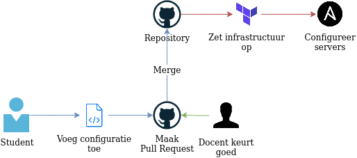

# Processen en werkwijzen

In dit hoofdstuk staan de werkwijzen beschreven die gehanteerd worden als het gaat om infrastructuur aanvragen.

## High-level

{#highlevel}

Zoals te zien in **figuur \ref{highlevel}** is het idee achter IaC dat een student virtuele machines aanvraagt door code toe te voegen aan een repository.
Deze wijziging kan vervolgens gecontroleerd worden door een administrator of docent en wordt er bepaald of de code gemerged mag worden.
Zodra de code toegevoegd is, dan staat binnen 10 minuten de gevraagde infrastructuur klaar.

Zodra de VMs niet meer nodig zijn, kan de administrator de code weghalen en zal de infrastructuur weer afgebroken worden.

\pagebreak

## Voor Studenten

Het aanvragen van een server voor studenten gebeurt in `student-machines.tfvars.json` zoals te zien in **listing \ref{studentaanvraag}**.
Een student voert zijn of haar studentnummer in en voegt een publieke SSH sleutel toe.
Vervolgens kan geconfigureerd worden welke image de server gebruikt, de grootte van de machine en of er automatische backups gemaakt moeten worden.

~~~{#studentaanvraag .json caption="JSON code om een VM aan te vragen"}
{
  "student_vms": [
    {
      "student_number": "2121993",
      "user_ssh_key": "ssh-rsa AAAAB3Nza[...]",

      "image": "ubuntu-18-04-x64",
      "size": "s-1vcpu-1gb",
      "backups": false
    }
  ]
}
~~~

Wanneer alle gegevens goed ingevuld zijn, zal een docent de pull request goedkeuren en zal de VM aangemaakt worden.
Via Ansible wordt er in de VM ook gelijk een gebruiker aangemaakt genaamd `s<studentennummer>` om mee in te loggen.

De student zal uiteindelijk kunnen inloggen via SSH met het commando: 

`ssh s2121993@2121993.student.avans-informatica-breda.nl`

Daarnaast is de VM te bereiken via _voorbeeld.student.avans-informatica-breda.nl_.

\pagebreak

## Voor Docenten

Het aanvragen van een server voor docenten gebeurt in `docent-machines.tfvars.json` zoals te zien in **listing \ref{docentaanvraag}**.
Deze JSON data komt sterk overeen met de student aanvraag, echter kan de docent een subdomein definiëren en een naam van de VM.
Daarnaast wordt ook de docent naam gebruikt in plaats van

~~~{#docentaanvraag .json caption="JSON code om als docent een VM aan te vragen"}
{
  "docent_vms": [
    {
      "docent_name": "Pascal van Gastel",
      "user_ssh_key": "ssh-rsa AAAAB3Nza[...]",
      "subdomain": "voorbeeld",
      "name": "EntryPoint",
      "ansible_group_name": "entrypoint",

      "image": "ubuntu-18-04-x64",
      "size": "s-1vcpu-1gb",
      "backups": false
    }
  ]
}
~~~

De docent zal uiteindelijk kunnen inloggen via SSH met het commando:

`ssh pascalvangastel@voorbeeld.avans-informatica-breda.nl`

Deze VM is beschikbaar via _voorbeeld.avans-informatica-breda.nl_.
